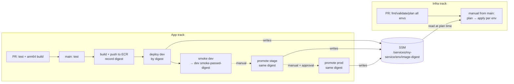

# ECS HTTPS service template (golden path)

A minimal, opinionated starting point for an HTTPS service on **AWS ECS Fargate (ARM64 / Graviton)**:

- `app/` – a tiny .NET 8 minimal API (`/` → hello, `/health` → 200) on port **8080**, with unit tests and a multi-stage, non-root Dockerfile.
- `infra/` – flat Terraform (no modules): ECR, log group, IAM roles, task definition, ALB + HTTPS (ACM, DNS-validated), Route 53 alias, ECS service with circuit-breaker rollback, SSM outputs.
- `scripts/` – everything the pipelines do, as plain shell scripts you can also run locally.
- `.teamcity/` – TeamCity Pipelines (YAML) for two independent tracks: **app** and **infra**.

Assumed to already exist: a VPC with public + private subnets (and NAT or VPC endpoints for ECR/Logs), an ECS cluster (default `main-ecs-cluster`), a public Route 53 hosted zone, an S3 bucket for Terraform state, and IAM roles the CI agent can assume.

## Layout

```
app/
  Dockerfile                 multi-stage, linux/arm64, non-root, EXPOSE 8080
  src/MyService/             minimal API
  tests/MyService.Tests/     xunit + WebApplicationFactory
infra/
  *.tf                       flat Terraform, aws provider ~> 5
  envs/<env>.tfvars          per-env inputs
  envs/<env>.backend.hcl     per-env partial S3 backend config
scripts/                     build, push, deploy, smoke, promote, tf-plan, tf-apply (+ test, lib)
.teamcity/                   app-pr, app-main, app-promote, infra-pr, infra-apply
```

## Flow



### How the two tracks stay independent

- **Terraform owns the shape** of the service (task definition CPU/memory/roles/ports, ALB, DNS...).
- **The app pipeline owns the image.** `deploy.sh` takes the service's *current* task definition, swaps only the image (pinned by **digest**), registers a new revision, rolls the service and waits. If the ECS circuit breaker rolls back, the step fails. On success the script writes `/services/<service>/<env>/image-digest`.
- **Infra applies never roll the image back.** `tf-plan.sh` reads that SSM digest and passes the value as `image_digest`; `tf-apply.sh` refuses to apply if the digest changed since the plan.
- **Promotion is by digest, never by rebuild.** `smoke.sh` records `smoke-passed-digest` per env. `promote.sh stage` deploys dev's smoke-passed digest; `promote.sh prod` deploys stage's. Both refuse any digest that never passed dev.

SSM parameters under `/services/<service_name>/<env>/`:

| name | written by | purpose |
|---|---|---|
| `ecr-repository-url`, `cluster-name`, `service-name`, `task-family`, `container-name`, `url` | Terraform | discovery for scripts/other consumers |
| `image-digest` | `deploy.sh` | currently deployed digest (read by Terraform plans) |
| `smoke-passed-digest` | `smoke.sh` | digests eligible for promotion |

## Using the template

1. **Create a repo from this template** and rename the service:
   - `service_name` in `infra/envs/*.tfvars`
   - `env.SERVICE_NAME` (and role names) in `.teamcity/*.yml`
   - optionally the `MyService` project names under `app/`, and `key` in `infra/envs/*.backend.hcl`.
2. **DNS:** set `hosted_zone_name` (e.g. `example.com`) and `domain_name` (e.g. `my-service.dev.example.com`) per env.
3. **Networking:** set `vpc_id` (or `vpc_tag_name`) and `public_subnet_tags` / `private_subnet_tags` to match your subnets. `cluster_name` defaults to `main-ecs-cluster`.
4. **State:** put your state bucket/region in `infra/envs/<env>.backend.hcl`.
5. **CI auth:** create IAM roles for the pipelines and set `env.AWS_ROLE_ARN` in each `.teamcity/*.yml`. Scripts call `sts:AssumeRole` from the agent's ambient identity (instance profile / task role) — **no static keys**. Alternatively use a TeamCity AWS connection that injects short-lived credentials and leave `AWS_ROLE_ARN` empty.
6. **Bootstrap order (first time only):**
   1. Infra apply **dev** (`create_ecr_repository = true` there – dev owns the shared ECR repo). With no digest in SSM yet, the service is created with **0 tasks**.
   2. Run the app main pipeline: this pushes the image, deploys dev (scaling the service to 1) and smoke-tests dev.
   3. Infra apply **stage** and **prod** (they look up the ECR repo), then promote.

### Local commands

```bash
# app
cd app && dotnet test tests/MyService.Tests/MyService.Tests.csproj
dotnet run --project app/src/MyService &   # listens on :8080
BASE_URL=http://localhost:8080 ./scripts/smoke.sh local

# image (arm64; works from x86_64 too because the SDK stage cross-compiles)
docker buildx build --platform linux/arm64 -t my-service:local app/
# or: ./scripts/build.sh local

# infra
cd infra
terraform init -backend=false && terraform validate
terraform init -backend-config=envs/dev.backend.hcl
terraform plan -var-file=envs/dev.tfvars -var "image_digest=$(aws ssm get-parameter --name /services/my-service/dev/image-digest --query Parameter.Value --output text)"
```

## TeamCity pipelines

Files in `.teamcity/` use the **TeamCity Pipelines YAML** format (pipelines are GA since TeamCity 2026.2) and were validated against the published JSON schema:
<https://www.jetbrains.com/help/teamcity/pipelines-yaml-syntax.html>.

| file | track | run |
|---|---|---|
| `app-pr.yml` | app | auto on PRs: unit tests + arm64 image build (no push) |
| `app-main.yml` | app | auto on `main`: test → build+push → deploy dev → smoke dev |
| `app-promote.yml` | app | manual from `main`, `env.TARGET_ENV=stage\|prod` |
| `infra-pr.yml` | infra | auto on PRs: fmt/validate/plan dev, stage, prod |
| `infra-apply.yml` | infra | manual from `main`, `env.TARGET_ENV=dev\|stage\|prod`: plan → apply |

Each step is a one-liner calling a script in `scripts/`. Create one TeamCity pipeline per file and point each one at the matching YAML in the repo.

Settings that **live outside the YAML** (configure them in each pipeline's settings in the UI):

- **Auto-run triggers / branch filters** – PR branches for the PR pipelines, `main` for `app-main`; none (manual only) for promote/apply. Ideally restrict the app track to changes under `app/` and the infra track to `infra/` (VCS trigger rules).
- **Pull request integration**, repository/branch specs, and integrations (e.g. AWS connection).
- **Approval for prod** – add the *Build Approval* feature to `app-promote` / `infra-apply` (or split prod into its own pipeline) so prod runs need a second person.

Agent requirements: bash, git, curl, jq, AWS CLI v2, Docker with buildx, Terraform ≥ 1.10. The test job runs inside `mcr.microsoft.com/dotnet/sdk:8.0`.

> Note: TeamCity Pipelines are evolving quickly and the JSON schema only checks structure, not every key inside a step. If your TeamCity version rejects a field, the same scripts can be called from classic build configurations (Kotlin DSL) unchanged.

## Shared ALB instead of one ALB per service

The template creates a dedicated ALB per service/env for simplicity. If your platform has a shared ALB, `infra/alb.tf` contains a commented recipe for replacing the per-service ALB with an `aws_lb_listener_rule` (host-header match) plus an SNI certificate on the shared HTTPS listener.

## Intentionally left out

Kept minimal on purpose; add when you need them:

- **Autoscaling** (`aws_appautoscaling_*`) – `desired_count` is fixed.
- **WAF**, Shield, custom security headers.
- **Blue/green / canary** deployments (CodeDeploy) – rolling update + circuit-breaker rollback only.
- Secrets (add SSM/Secrets Manager refs to the task definition + execution role permissions), VPC endpoints, alarms/dashboards, tracing.
- Cross-account promotion (single ECR repo assumes environments share an account, or add an ECR repository policy for the other accounts).
- A committed `.terraform.lock.hcl` – generate one with `terraform providers lock -platform=linux_amd64 -platform=linux_arm64 -platform=darwin_arm64` and commit the file in your service repo.
